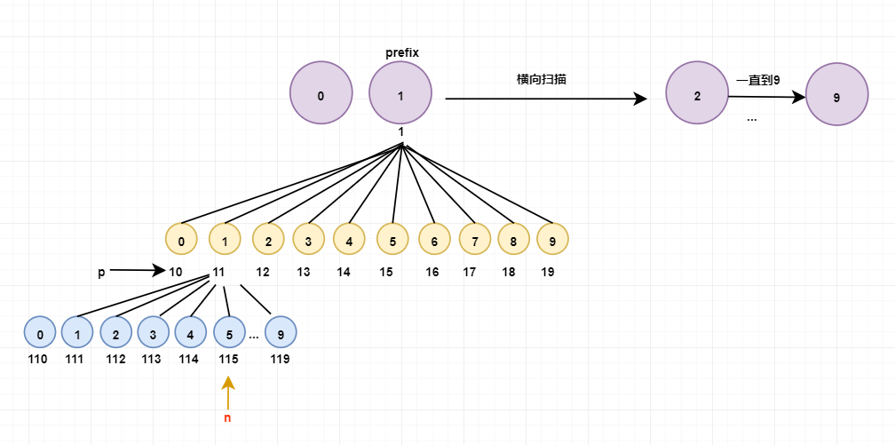

# 440 字典序的第 K 小数字

给定整数 n 和 k，找到 1 到 n 中字典序第 k 小的数字。

注意：1 ≤ k ≤ n ≤ 10 \*\* 9。

```md
输入:
n: 13 k: 2

输出:
10

解释:
字典序的排列是 [1, 10, 11, 12, 13, 2, 3, 4, 5, 6, 7, 8, 9]，所以第二小的数字是 10。
```

leetcode

- [https://leetcode-cn.com/problems/k-th-smallest-in-lexicographical-order/](https://leetcode-cn.com/problems/k-th-smallest-in-lexicographical-order/)

题解

- [findKthNumber.ts](./findKthNumber.ts)

图示

- 
